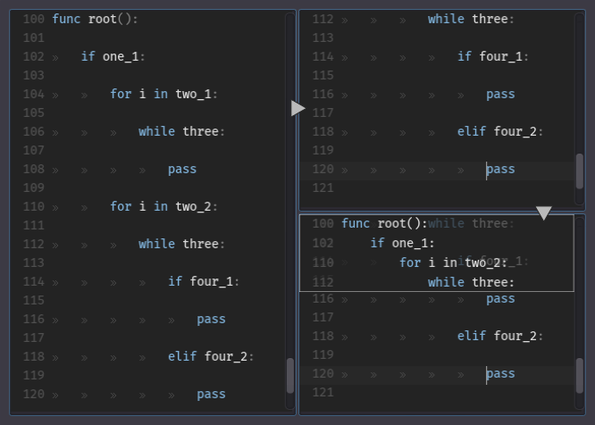

# Nested Code Box
A plugin for the [Godot game engine](https://github.com/godotengine/godot) [2.1.1].
It display the hidden start blocks in a frame at the top of the script editor.

The caret must be placed between the indentation and the code, the box appears after some seconds, the displayed lines depends of the **indentation** of the **current line** and of the **number of availables lines** above of the current line (minus lines_gap, see below).
The box is hidden when the caret is moved, when the script is changed, scrolled or resized, or when the box is overflyied.
When the horizontal scrolling is greater than zero (or almost) the box is not displayed.

The used editor settings are:
* Text Editor > Background Color
* Text Editor > Text Color
* Text Editor > Keyword Color
* Text Editor > Line Number Color
* Text Editor > Syntax Highlighting
* Text Editor > Show Line Numbers
* Text Editor > Font

cfg.json:
* *max_lines* : The number of lines is always less or equal to this number (0 = auto)
* *from_root* : The first line is the less indented block but some intercalated blocks can be absents
* *hide_visible* : Allow the box to hide a visible parent block (taken back in the box), the number of lines is often bigger
* *hide_first_line* : Override 'hide_visible=false' for the first line, and the following if the blocks are close
* *enable_targetting* : Activate the targetting of the parent blocks
* *ignore_echo* : Don't show the box if the caret is stayed on the same line
* *ignore_white* : Don't show the box if the line contains only spaces/tabs (the empty lines are always ignored)
* *delay* : Time in seconds before to show the box. The display is canceled each time something happens in the text editor
* *lines_gap* : Minimal number of lines between the current line and the box (0 to 3)
* *lines_margin*: Minimal number of lines above of the current line when a parent block is targetted